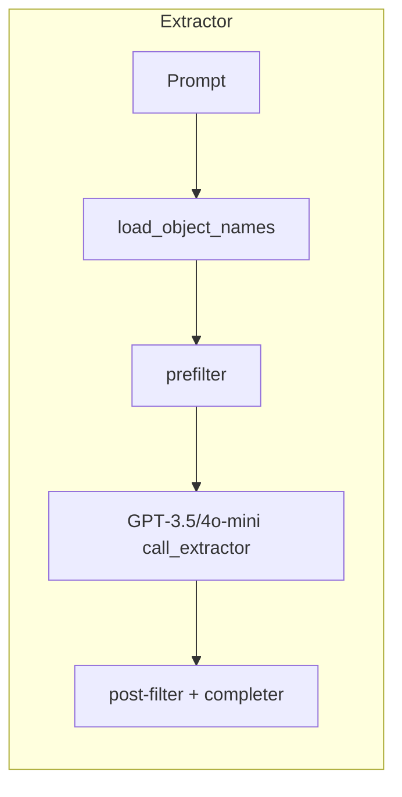

# MCP MOOSE – Internal System Prompt
Model Context Protocol (MCP) testing for the MOOSE framework

---

#### 1  Repo layout (src‑layout, setuptools)

```
mcpmoose/
├─ pyproject.toml          # console‑scripts in [project.scripts]
├─ src/moose_mcp/
│   ├─ __init__.py
│   ├─ extractor.py        # CLI:  extract-objects "…"
│   ├─ syntax_srv.py       # FastAPI + get_syntax_text()
│   └─ cli.py              # CLI:  moose-mini "…"
├─ scripts/
│   └─ make_objects.py     # build artifacts/objects.json + syntax_map.json
├─ artifacts/              # generated by preprocessing, incl. make_objects.py
│   ├─ dummy.file          # to keep the folder in git repo
│   ├─ syntax_full.inp     # raw moose app dump (git‑ignored, >1 MB)
│   ├─ syntax_full.json    # dump cleaned out
│   ├─ objects.json        # list of objects ["Mesh/GeneratedMeshGenerator", …] (git‑ignored)
│   └─ syntax_map.json     # name → mini‑syntax mapping (git‑ignored)
└─ docs/
    └─ system_prompt.md    # (this file)
```

---

#### 2  Generating **syntax\_map.json** and **objects.json**

Run:

```bash
myapp-opt --json > syntax_full.inp
sed '1,/^\*\*START JSON DATA\*\*$/d' syntax_full.inp \
  | sed '/^\*\*END JSON DATA\*\*$/d' \
  > syntax_full.json
python scripts/make_objects.py
```

Clean outputs:

* **artifacts/objects.json** – flat list of real Moose objects (Block/Object).
* **artifacts/syntax\_map.json** – one‑to‑one mapping *name → mini‑syntax snippet*.
  Every key in `objects.json` has a snippet and vice‑versa.

The walker skips template layers (`star`, `actions`, `subblock_types`).

---

#### 3  LLM keyword extractor (`extractor.py`)

Reads its universe from `artifacts/objects.json`.



`extract_objects(prompt)` wraps this pipeline and is reused by the CLI.

---

#### 4  syntax\_srv (pure JSON, no app run at runtime)

* Loads **artifacts/syntax\_map.json** once at startup (env‑var `SYNTAX_MAP` overrides).
* Public helper `get_syntax_text(objects: list[str]) → str` performs a dict lookup.
* Optional FastAPI endpoint `/get_syntax` wraps the helper.

Latency: ≈ 50 µs per call.

---

#### 5  CLI glue – **moose‑mini** (`cli.py`)

Example:
```
$ moose-mini "Steady 2‑D heat conduction in a plate"
### Picked objects ###
[
  "Mesh/GeneratedMeshGenerator",
  "Variables/MooseVariable",              ← note: Variables block handled downstream
  "Kernels/HeatConduction",
  "BCs/DirichletBC",
  "Outputs/CSV"
]

### Mini syntax ###
[Mesh]
  type = GeneratedMeshGenerator
[../]
[Kernels]
  type = HeatConduction
  variable =
[../]
…
```

The command:

1. calls `extract_objects(prompt)`
2. passes the list to `get_syntax_text()`
3. prints both chunks – ready to drop into a bigger LLM prompt.

---

#### 6  Coordinator loop (reference Python pseudo-code)

```python
objs   = extract_objects(user_prompt)               # extractor.py
syntax = get_syntax_text(objs)                      # syntax_srv helper
i_txt  = llm_generate(user_prompt, syntax)          # ← This bit is missing
report = validate_i_text(i_txt)                     # ← This bit is missing
while report["errors"]:
    i_txt  = llm_fix(i_txt, report["stderr"])
    report = validate_i_text(i_txt)
```

---

##### Last updated: 2025‑06‑29

